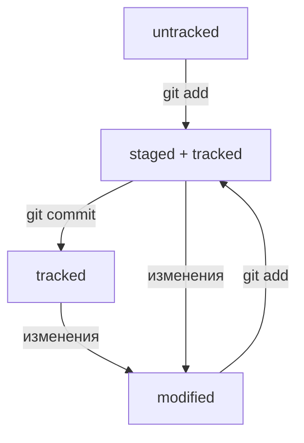

# Инструкция по созданию (добавлению нового) проекта:
1. Открыть Командную строку BASH
2. cd <путь до место хранения проектов (далее 2.1) / проекта (далее 3)>
2.1. mkdir <наименование новой папки для нового проекта>
3. git init (создание локального репозитория)
4. git add . (добавление файлов (для отслеживания) / изменений файлов)
5. git commit -m "<Сообщение коммита>" (фиксирование текущего состояния файлов)
6. Через браузер: создание репозитория в удаленном хранилище
7. git remote add <локальный псевдоним удаленного репозитория> \<url удаленного репозитория\> (добавление удаленного репозитория)
8. git push -u <локальный псевдоним удаленного хранилища> <локальная ветка>

Дополнительно:

rm -rf .git (удалить локальный репозиторий с сохранением файлов проекта)

## Коммиты

git log (коммиты ветки) (q - выход)

git log --oneline (коммиты ветки в сокращенном варианте)

Если нужно передать последний коммит, то вместо его хеша можно просто написать слово HEAD — Git поймёт, что вы имели в виду последний коммит.

В выводе команды git log --oneline умещается максимум 72 первых символа сообщения, поэтому многие правила включают пункт: «Сообщение не должно быть длиннее 72 символов»

## Статусы

Для файлов в состояниях staged и modified обычно не указывают, что они также tracked, потому что это состояние подразумевается.
